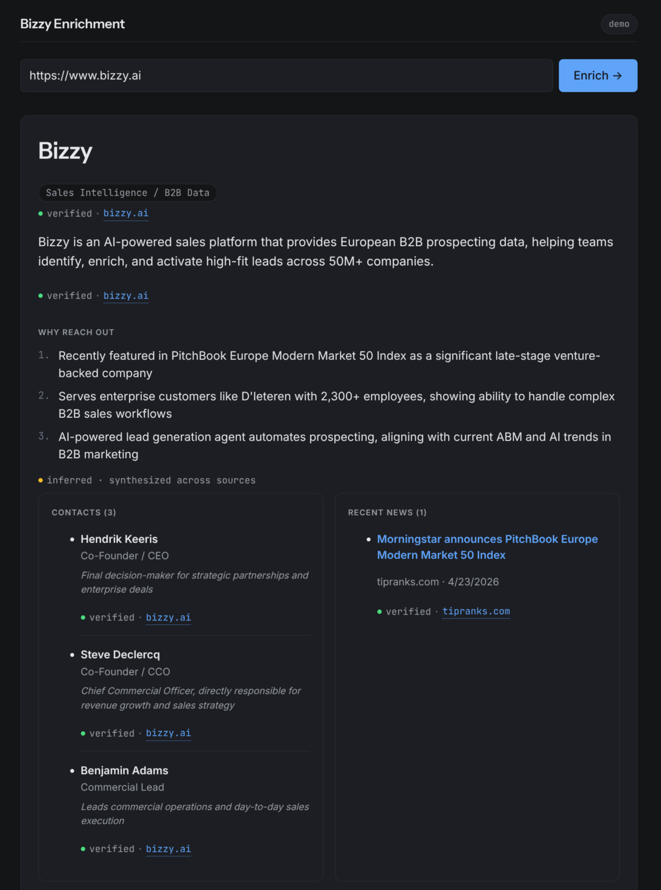
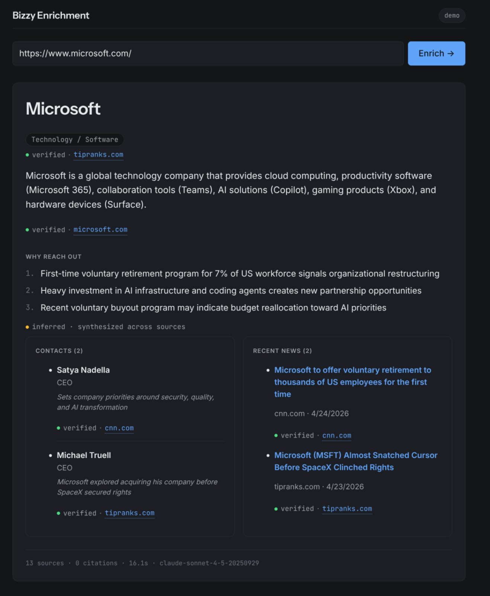

# Bizzy URL Enrichment

<p>
  
  
</p>

> **Design and approach:** see [`docs/DESIGN.md`](docs/DESIGN.md).
> **Eval results:** see [`eval/results.md`](eval/results.md).

A URL → enriched company profile, with every quotable claim tied to a source span via Claude's Citations API.

## What it does

You paste a company URL. The pipeline fetches the homepage (Cheerio, with a Cloudflare Browser Rendering fallback for JS-only sites), `/about` and `/team`, Tavily for citable news snippets, and Google News RSS (locale-aware) for press in the company's region. Claude reads the bundle and emits structured JSON where every fact carries a `supporting_quote`. A post-validator drops any field whose quote isn't either present in a returned API citation or a verbatim substring of one of the source documents (two-stage grounding), and drops any contact whose name isn't literally in the quoted span. The UI labels each field `verified` (grounded + entity-confirmed), `inferred` (synthesized across sources), or `unknown` (sources didn't support it).

## Live demo

- **URL:** https://bizzy-enrichment.fly.dev/
- **Demo key:** demo key needed (sent via email)

## On scope

I made two deliberate expansions beyond a minimal prototype because they're the cheapest way to answer the brief's most important question:

1. **An eval harness** (`eval/`) — the brief says the "how confident are you?" question matters most; an eval is the shipped answer. 7 hand-verified companies across big-US, mid-EU, small-BE, and obscure tiers. Numbers, not claims.
2. **A live Fly.io deployment** — so the reviewer hits a working URL in 10 seconds, no clone required.

I held scope firmly against four other tempting additions, called out in `docs/DESIGN.md` §4 and below.

## Run locally

```bash
cp .env.example .env
# Required:
#   ANTHROPIC_API_KEY      Claude
# Recommended:
#   TAVILY_API_KEY         broader news coverage; without it only Google News RSS is queried
# Optional:
#   CLOUDFLARE_ACCOUNT_ID + CLOUDFLARE_API_TOKEN   JS-heavy site fallback (Browser Rendering /content)
#   DEMO_KEY               enables shared-secret auth + rate limit (required in prod)
#   ANTHROPIC_MODEL        defaults to claude-sonnet-4-5-20250929
#   LOG_LEVEL              info (trace|debug|info|warn|error|fatal|silent)
#   RATE_LIMIT_PER_HOUR    20 per IP
#   TIMEOUT_MS             60000 global request timeout
#   CORS_ORIGIN            unset = same-origin only
#   PORT                   3000

bun install
bun run build      # builds the SPA into dist/
bun run start      # http://localhost:3000

# or for hot-reloading dev with separate web server:
bun run dev:server   # backend on :3000
bun run dev:web      # Vite on :5173 with proxy to :3000
```

`DEMO_KEY` is unset locally → no auth required. Setting `DEMO_KEY=…` in `.env` activates the gate and rate limit even on localhost.

## Run the eval

```bash
# against localhost (start the server first)
bun run eval

# against the deployed instance
EVAL_TARGET=https://bizzy-enrichment.fly.dev EVAL_DEMO_KEY=<key> bun run eval
```

Writes `eval/results.md` with aggregate metrics + per-company breakdown.

## Run the tests

```bash
bun test
```

Five files cover the riskiest paths: SSRF rejection, citation reconciliation, validator entity-containment + LLM-URL guard, auth middleware (including the "empty-string must not silently bypass" failure mode), and env validation.

## Architecture

See `docs/DESIGN.md` for the full design and `docs/BUILD_PLAN.md` for the phase-by-phase implementation plan.

```
URL → SSRF guard → homepage fetch (Cheerio → CF Browser Rendering /content) →
   ┌─ /about + /team (Cheerio)
   ├─ Tavily search
   └─ Google News RSS (locale-aware)
→ document bundle (≤8) → Claude Citations API → reconciliation (normalize quote ↔ cited_text)
→ entity-containment validator → JSON {summary, industry, reasons, contacts, news}
```

Three layers prevent the rep from ever seeing a fabricated fact:

1. **Two-stage grounding.** First-pass: Claude's Citations API returns a `cited_text` span — match Claude's `supporting_quote` against it. Second-pass (fallback): if the API didn't fire citations on this generation, accept the quote when it appears verbatim as a substring of one of the source documents we sent. Both signals yield `verified`; failing both → `inferred` and the field is dropped from contacts/news.
2. **Entity containment** — if the quoted span doesn't literally contain the name/headline, drop it.
3. **Source-quality gate** — if the homepage fetch fails or returns under 100 chars of text, we skip Claude and return `source_fetch_failed`. Other fetchers (`/about`, `/team`, Tavily, GNews) are best-effort — their failures land in `_debug.failures` without aborting.

Plus a fourth, narrower layer: **LLM URL guard.** Any `news[].url` Claude emits is rejected unless it parses as `http(s):` — defends against prompt-injected `javascript:` / `data:` URLs that would otherwise render as a clickable `<a href>`.

## Where it's weak

- **Contacts on small SMEs** — v0 only extracts from the company's own pages. Production would use Proxycurl / PDL / Cognism. Expect 0–1 contacts on small Belgian SMEs.
- **No caching** — every request hits live sources. Production caches by `(URL + source-version-hash)` with a 24h–7d TTL depending on field.
- **English-only prompts** — GNews's locale-aware queries partly compensate, but the LLM still reasons in English.
- **TLD-based locale is crude** — `.be` is queried as both `nl-BE` and `fr-BE`, but Wallonia vs Flanders coverage isn't perfect.
- **No streaming** — the full result lands at once; production would stream summary first, then enrich.
- **Eval at 7 companies** is too small for real precision/recall. Production wants 50–100+.
- **Sites with aggressive anti-bot blocking** — large enterprise sites (e.g. `tesla.com`, `apple.com`) front their homepages with Akamai / Cloudflare Bot Management that fingerprint TLS + IP and return `403` to anything from a datacenter, regardless of User-Agent. Cheerio fails fast, the Cloudflare Browser Rendering fallback often gets blocked too because Tesla et al. recognise its fingerprint. The pipeline degrades gracefully (`source_fetch_failed`, never a fabricated result) and the new structured logs surface the exact failure (`status: 403`, CF `success: false`, etc.). Production path: a residential-proxy scraping API tier (ScrapingBee / ScraperAPI / ZenRows, ~$0.001/req) wired into the same `Scraper` seam.
- **Google News RSS misses small SMEs** — `news.google.com/rss/search` is restricted to articles Google's News aggregator has indexed, which is a much narrower set than what the `news.google.com` web UI surfaces (the UI blends in web/blog/press-release results for low-volume queries). For small Belgian companies the RSS feed routinely returns 0 items even when the UI shows hits. Tavily compensates when configured; for production this is the reason the design calls for a contracted news API.

## What's next

- Paid contacts provider integration (Proxycurl / Cognism for EU SMEs).
- Streaming output via SSE so summary + industry render before contacts/news land.
- Expand the eval to 50+ companies with a "this is wrong" feedback channel feeding the eval set.
- Eager Cloudflare Browser Rendering prefetch for known JS-heavy domains (currently we wait for thin Cheerio output before falling back).
- Per-tenant cost guards once the cache exists.

## What I deliberately didn't build, and why

**Direct LinkedIn scraping** is the obvious source for contacts but a dead end at any scale — HTTP 999 challenges, authwalls, TLS fingerprinting, and legal exposure that survived `hiQ v. LinkedIn` in 2022. The production path is a paid provider. In v0 I chose to extract only from the company's own pages and document the gap rather than ship a flaky scraper that would feel dishonest the first time it returned "Sarah Chen, CEO" at a 5-person Belgian startup whose actual founder is Jan Peeters.

**Caching, streaming, multi-language prompting, paid APIs** are all in the production architecture in `docs/DESIGN.md` §5 — held off in v0 but cheap and obvious to add in a real engagement. The interesting question for hiring is whether the architecture supports them; my answer is yes, here's the seam.
